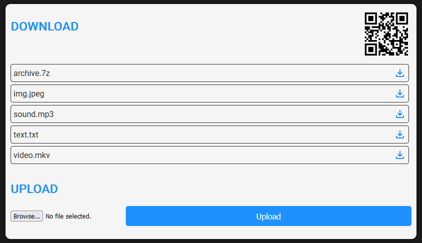

# FastAPI Simple File Download Application



Этот проект представляет собой простое веб-приложение, разработанное с использованием FastAPI, которое позволяет загружать файлы из директории `downloads` на компьютере и отображать их на веб-странице. Ключевая задача, которую решает проект - в рамках локальной сети скачать что-то на Iphone с компьютера под управлением Windows без особых заморочек и без использования сторонних сервисов. Например, у вас есть фотографии на основном компьютере и вы хотите их скачать себе на Iphone, не выкладывая их на какой-либо внешний ресурс, во избежание кражи или утечки. 

Приложение работает только внутри локальной сети, где хранилищем выступает ваш собственный компьютер, на котором запущено приложение. Файлы не шифруются и передаются как есть.

На главный экран также выводится QR-код. Он предназначен для того, чтобы с мобильного устройства была возможность быстро открыть локальный адрес сервиса при помощи браузера. Обратите внимание, что мобильное устройство и хост с запущенным приложением должны находиться в одной локальной сети.

## Функциональность

- **Главная страница**: Отображает список всех файлов, доступных для загрузки из директории `downloads`.
- **Загрузка файлов**: Позволяет пользователям загружать файлы, щелкнув по ссылке на файл.

## Установка

Для установки и запуска приложения выполните следующие шаги:

1. **Клонируйте репозиторий**:

   ```bash
   git clone https://github.com/FirstEncounter3/FastAPISelfHostedDownloadSimpleService.git
   cd <имя_папки_куда_клонирован_репозиторий>
   ```
2. **Создайте виртуальное окружение, установите зависимости и запустите веб-сервер. Для автоматизации процесса предоставлен bat файл. Запустите его:**
    ```bash
    setup.bat
    ```

## Использование
   1. После запуска сервера будет создан каталог downloads в корне проекта, куда можно будет поместить файлы. Добавьте файлы в данную директорию.

   2. Откройте веб-браузер и перейдите по IP адресу вашего компьютера (если внешнее устройство) или откройте http://127.0.0.1:8000. Вы увидите список файлов, доступных для загрузки. Нажмите на файл, чтобы начать загрузку. Если файлов нет - выведется уведомление. Добавьте файлы в указанную папку и обновите страницу браузера.
   
## Зависимости проекта
* [Fastapi](https://fastapi.tiangolo.com/)
* [Jinja2](https://jinja.palletsprojects.com/en/stable/)
* [Uvicorn](https://jinja.palletsprojects.com/en/stable/)
* [Qrcode](https://github.com/lincolnloop/python-qrcode)
* [Pillow](https://github.com/python-pillow/Pillow)

## Лицензия
Этот проект лицензирован под MIT License. Пожалуйста, смотрите файл LICENSE для получения дополнительной информации.

## TODO
- [ ] **Добавить возможность загрузки**: Чтобы сделать полноценный обмен в обе стороны.
- [ ] **Авторизация**: Для возможности поделиться ссылкой на файл (при условии, что сервис будет развернут в сети)
